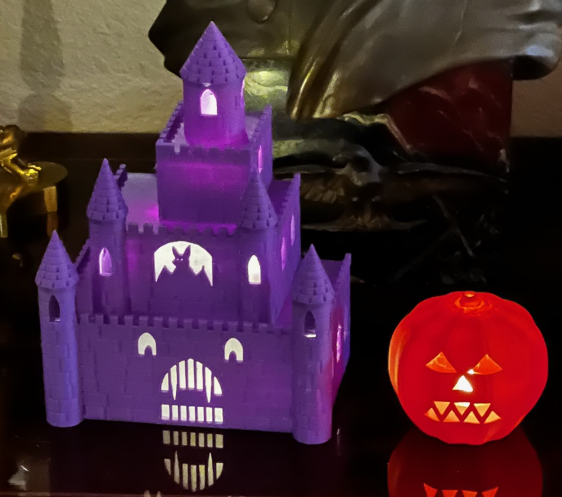
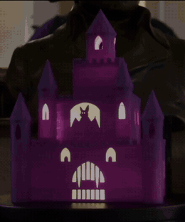

# The Haunted Castle

Something lives in this castle and it is not paying rent. Four tiers of megalithic stonework, a gate with a full set of teeth, a bat that has evidently been told it may stay, and two upstairs windows that watch you cross the room. Put tea lights in the back and the whole facade lights from within — which is precisely as reassuring as it sounds.

136 × 92 × 178 mm, and eleven hours of your printer's life. Twice, in our case.

Purple PLA, paper diffusers behind the bat window and behind the face. The pumpkin is [`pumpkin_lantern`](../pumpkin_lantern/).

**The back of the turn is the useful half.** It shows the configuration the object actually lives in, and none of it is in the model: **six** tea lights rather than one per chamber — three in the ground floor, two in the middle, one at the top — with the lower five **lying on their sides aimed out through the facade** and only the top one standing upright. There is paper inside the chambers as well as behind the openings, bouncing light forward off the floors. Read the design as a lantern that takes as many pucks as you care to feed it, not as a three-socket fixture.

## Printing it as-is

`accepted/castle.stl` is the mesh that was actually printed. It is already in the print pose, so do not rotate it.

| | |
|---|---|
| material | PLA |
| layer height | 0.2 mm |
| orientation | upright, as exported |
| supports | **tree, Hybrid** — required |
| time | ~11 hours |

**It is 178 mm tall on a 180 mm machine.** Check your Z before you slice. If that is too close for comfort, scale to 50% in the slicer for a two-hour version — or print [`mini_castle`](../mini_castle/), which is the same object properly reworked for half size rather than merely shrunk.

Four support settings matter, and one of them is not optional:

- **`Support on build plate only` → OFF.** This is the setting that destroyed the first attempt. See below before you decide you know better.
- **Tree branch angle → 30°**, so branches lean less far from vertical.
- **Bottom shell layers → 5**, so the chamber ceilings have more solid material resisting the peel when supports come away.
- **`Remove small overhangs` → ON.** Without it the slicer props every mortar course, on the show side.

Supports land inside the chambers, where nothing shows. That is the cheap place for them.

**Your filament colour changes what this object is.** The castle was designed as a silhouette — opaque walls, light only where the wall is absent. In a light colour at 2.4 mm that assumption is simply false: the walls transmit, the whole facade glows, and it reads as lit stone rather than as a dark box with holes in it. The photograph above is what purple does. Black would give you the silhouette the model actually describes. Neither is wrong; pick deliberately, because it is the single biggest visual decision you will make and it is not in the mesh.

## Finishing it

Almost nothing, which is the nice part.

1. Drop **flame-style battery tea lights** into the chambers through the open back. One per chamber is the design; the printed one runs **six** — three, two and one going up — because the chambers are wide and a single puck lights the middle of a storey better than its corners. They lift out again for battery changes; that was a design requirement, not an accident.
2. Lay the lower pucks **on their sides, aimed out through the facade.** That is how the photographed one is set up and it is worth doing: on its side a puck is a point source at mid-height pointing at the openings, instead of a column standing on an opaque base. Leave the top one upright, where its flame is visible through the window.
3. Optionally glue **printer paper** behind the face's openings with a glue stick, to spread the light. Loose paper laid inside the chambers helps too, bouncing light off the floors toward the front.

The paper is genuinely optional. The design assumed it was load-bearing — a bare puck is nearly a point source and the eyes and mouth are far apart — and then the first lit test was done with bare pucks and no diffuser at all, and the face read fine. So paper is an improvement to something that already works.

Puck orientation is worth treating as a real variable rather than a fiddle, and nothing in this repo models it — see [`owl`](../owl/) and [`mini_castle`](../mini_castle/), both of which ended up sideways at the bench for the same reason.

## Making it your own

The most transferable thing here is not a technique, it is a habit:

> **When a print fails, ask what the slicer was *forbidden* to do before you change any geometry.**

An eleven-hour print failed here and the model was never at fault. `Support on build plate only` sounds conservative, and on a hollow part it is the opposite: every chamber floor is model material, so that setting forbids a support from standing on one and forces the slicer to originate outside the footprint and lean in through the open back. A 32–45 mm column becomes an 88–122 mm one, and a tall leaning tree topples early, while it is still a thin unbraced stick. Same mesh, four settings changed, perfect print.

Two more that transfer to parts nothing like this one:

- **Geometry sized from one constraint and never checked against its surroundings** is a single bug that wore six different costumes here — crenellations cut full depth, a platform punched through a side wall, tower joints sawing through the base slab. `notes.md` names the pattern and lists the assertions that catch it. If you write one thing into your own parts from this repo, write those.
- **A render cannot show surface texture at whole-part zoom.** The review sheet showed smooth walls while the mortar was being cut perfectly correctly, because the renderer's depth-jump threshold scales with the view — 0.66 mm against a 0.6 mm groove. Detail needs detail crops, at full resolution. Believing an unzoomed render is its own failure mode.

To change the castle itself, `notes.md` is the file to read first — it explains why the numbers are what they are, which is invisible in the source. The scale is declared (1:120, so a foot is about 1.4 mm) and features are sized in feet and then checked against the nozzle, rather than chosen to suit the nozzle and left meaning nothing.

## Final notes

**It is not a member of the `halloween_lantern` project**, even though it reads that project's measured tea light dimensions. An import is not membership: it shares none of the set's envelope, height or standards, and declaring otherwise would make the set's shared numbers answer to a part that does not follow them.

**`model.py` is 1858 lines**, over this repo's own thousand-line guideline. It is the honest size for the object, but it is the first thing to split if it grows again.

**The turrets are unlit, on purpose.** Paper is fitted behind the bat window and behind the face, but the turret shafts were never lined and will not be. Reaching them means either more pucks or four separate light paths, against a facade whose depth is already spent on what a puck needs — a lot of structure for a small effect on an object where a dark window is not a defect. That is recorded as an **abandoned** criterion rather than an unmet one, because those are different things and only one of them is a fault.

**Six tea lights is a lot of switches**, and it is the honest cost of the design. Batteries come out through the open back by hand, which is tolerable rather than pleasant. If it ever stops being tolerable the answer is wiring, not geometry: a single warm LED source behind the open back reaches all three chambers, since every one of them is open at the rear. Note that this changes the object — steady light where six flames flicker.
