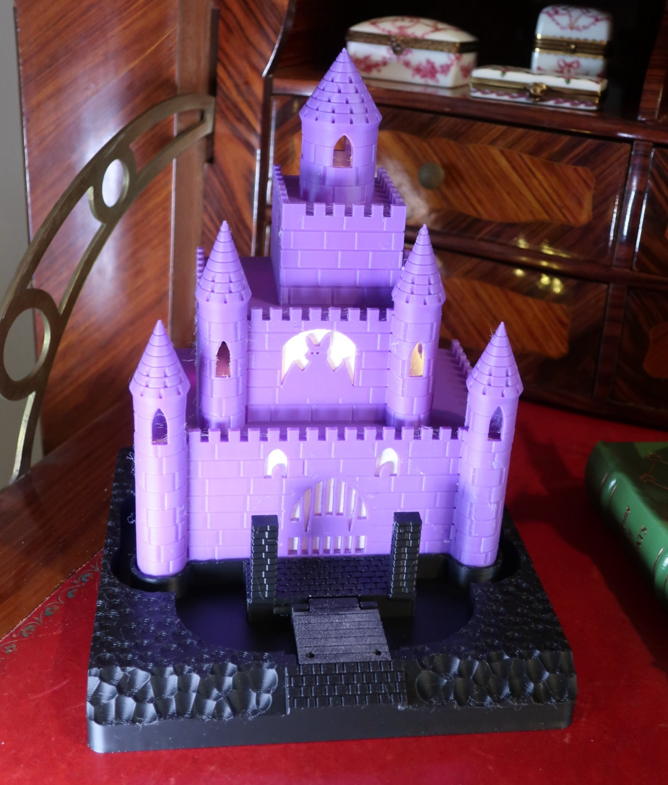

# The Castle Base

Ground for [`castle`](../castle/) to stand on, because until now it ended at a flat rectangle and that was the one place the illusion stopped. A moat, a cobbled forecourt, two gate piers, and a drawbridge on a printed pin hinge that actually lets down — held up by real chain you thread yourself. There is a sign planted beside the approach, in case anyone is unclear whose castle this is.

158 × 159 × 50 mm for the base, plus three small pieces. Four separate prints, or one crowded plate.

**The sign in the photograph says KATHY'S and the model ships DRACULA'S.** That is the point of it — `sign_lines` is two strings and the board is sized from them, so put whatever you like on it. Widen `sign_w` if your wording is longer; `check()` will tell you the exact millimetre at which the type runs into the border rather than letting you find out on the plate.

## Printing it as-is

`accepted/` holds the meshes that were actually printed, one per piece. They are already in their print poses, so do not rotate them.

**`accepted/castle_base-sign.stl` says KATHY'S**, because that is the sign that was printed and photographed. `model.py` ships DRACULA'S. Rebuild the sign rather than printing the accepted mesh if you want the wording the model describes — or your own, which is the whole idea.

| | |
|---|---|
| material | PLA, and a second colour for the sign's lettering |
| layer height | 0.2 mm |
| orientation | as exported — base island-up, deck face-down, sign face-up |
| supports | **none, anywhere** |
| infill | low — see below |

**Nothing on any piece overhangs.** Every hollow — moat, seat, hinge bores, peg sockets — opens upward in the pose it is exported in. That is a design constraint rather than a happy accident, and it means the whole set prints support-free.

**Do not print the base solid.** It is 421 cm³ of enclosed volume, and at 100% infill that is over half a kilogram of filament for a plinth. Its mass is a slicer setting and deliberately not a geometric feature — there is no lightening pocket in the model, because putting one there would have been solving a slicer problem in geometry.

**Wash your build plate first.** This is the part that will find a marginal one. The underside is a single flat 251 cm² face, and at that size every square millimetre is bearing: a small footprint on a slightly dirty plate holds on anyway, and when it does fail it lifts and announces itself. This tears instead, on the first layer, and the symptom points the wrong way — lines splitting and the nozzle dragging through what it just laid reads as a Z-offset problem. It was adhesion. A freshly washed plate fixed it with no other change.

**The sign wants contrast, not deeper letters.** Contrast and depth are substitutes here, and contrast is much the cheaper one. There are three ways to get it:

| | letters | notes |
|---|---|---|
| **filament change** | 3 layers | pause at the board's face, load a second colour |
| **ink the letter tops** | 3 layers + | paint pen or marker; no pause, no purge bleed |
| **one bare colour** | ~12 layers | the shadow the type throws is all you have |

At three layers the stems stop being tall thin walls, which is the most fragile thing on the piece — so the shallow routes are better in every respect once the contrast is there, not merely cheaper.

**Inking is the least trouble and the least documented.** The type is raised, so a pen dragged across the letter tops colours them and nothing else, on a single-filament print. Its floor is set by something the other two don't care about — the relief has to keep the tip off the board *between* the stems — and that number is **unmeasured here**. At this type size the gaps and counters are a millimetre or two, so three layers is likely marginal for a round bullet tip that can dip into them; a flat or chisel tip that bridges rather than dips is the safer tool. Depth costs nothing in this regime, so use more of it if in doubt.

**The board carries no raised frame** — but only because of the filament change. A pause is per-layer, not per-region, so a frame would print in the same layers as the bottom of every letter and recolour with them. **If you ink instead, that objection disappears and you can have the frame back**: set `sign_relief` above zero, since a pen colours what it touches rather than what shares a layer with it.

## Putting it together

1. **Seat the deck fully home between the piers before sliding the pin across.** The pier bores are slotted open at the top, so the pin goes through the deck's lug on the bench and the pair drops in — but it will not slide until the deck is all the way down. Nothing in the model says so, and it is the sort of thing that gets rediscovered by forcing something.
2. **Push the sign onto its two pegs.** 0.25 mm of clearance per side: no persuasion needed, no wobble once seated.
3. **Thread chain from the top of each pier to the deck's outer corners.** Every build prints `chain_up` and `chain_down` so you can check real chain against them before cutting it.
4. **Drop the castle into its seat.** It lifts out again, as does the bridge, as does the sign — all three were design requirements rather than accidents.

**If you glue the hinge pin, glue it to the deck's lug and not to the piers.** Both stop it walking out; only one keeps the bridge removable. The lug is a closed bore, so a pin fixed in the piers captures the deck permanently. Fixed to the lug instead, pin and deck become one piece that still drops in and still turns. Keep adhesive off the ends of the pin, which is where it runs.

**Expect the chains to hold the bridge only slightly raised** — a few degrees, not half-open. A fixed-length chain cannot be taut with the bridge up *and* permit lowering, so it stops the bridge well short of vertical. That is what a real drawbridge looks like mid-operation, and what sells it is the chain being taut and the deck off its seat rather than how far it has travelled. If you were expecting forty-five degrees, nothing is wrong.

## Making it your own

The lesson worth carrying to parts nothing like this one:

> **A check that the assembled object is correct is not a check that it can be assembled.**

The first generation of this part could not be put together. The hinge axis sat exactly on the forecourt's front face, so the pin would have had to be threaded through fifteen millimetres of solid stone. Every check passed — correct diameter, bores aligned, no interference between pieces, a flawless assembled render — because every one of them asked whether the finished object was right. None asked whether there was a path for the parts to reach that state. `check()` now asserts a clear run for the pin, in cubic millimetres of material in its way.

The same gap has a second half, still open and recorded as such: the pin is a plain cylinder in a clearance bore with nothing wider than the bore at either end, so it walks out when the base is tilted. In service the chains bind it, which is a real fix needing no reprint — but the thing doing the retaining is **outside the model**, so it lapses the moment the chains come off. Every hinge criterion asks whether it goes together and turns. None asks whether it stays together.

Two more that transfer:

- **Carve first, texture last.** The ground's undulation is cut, never added — spheres bitten out of a slab, so nothing can end up below the face the whole thing stands on. Roughing the flat ground first, while the slab is still a bare prism and the boolean is cheapest, is the obvious optimisation and it silently returns an empty solid. There is a good deal in `notes.md` about making a few hundred boolean tools finish in seconds rather than minutes, and it generalises to rivets, perforations and speed holes.
- **Two constraints can hide inside one.** The moat originally stopped a quarter of the way down each side, on the reasoning that a full wrap needed a base wider than the plate. It did not: width limits how *wide* the flank channel can be and says nothing about how far *back* it runs. Depth was never tight. A moat stopped for no reason, from two different limits collapsed into one.

## Final notes

**It reads the castle's ground plan from [`assemblies/castle_ground.py`](../assemblies/castle_ground.py)** rather than measuring it off the castle solid, and no castle dimension is repeated here as a literal. That file is worth reading on its own: it is the clearest example in this repo of what an assembly interface is for, and why building the castle to ask it a question would have cost eighty seconds per iteration of the base.

**The ground reads as rubble and broken rock rather than as loose dirt**, which is not what the parameter was named for. At this amplitude and grain it looks like a boulder field. It suits a castle and nobody has complained, so it is filed as a thing that is good rather than a thing that is right. Genuinely loose dirt means a finer grain and a bigger sphere, and both costs are superlinear.

**The sign is enormous** — twenty-three feet across at the castle's own scale. That is the same absurdity the cobbles already carry, and it is deliberate: a real six-foot sign at 1:120 carries quarter-millimetre lettering, so the choice is an oversized sign or a blank board. Where printability and scale disagree, printability wins and the disagreement gets said out loud.

**The castle is unmodified by all of this**, on purpose. It is a published, printed, eleven-hour object, and nothing here may require reprinting it — which is why the chain anchors are on piers belonging to this part rather than in the facade where a real drawbridge's would be. A second generation that reworks the castle to meet this part properly is the obvious next move and is explicitly out of scope.
