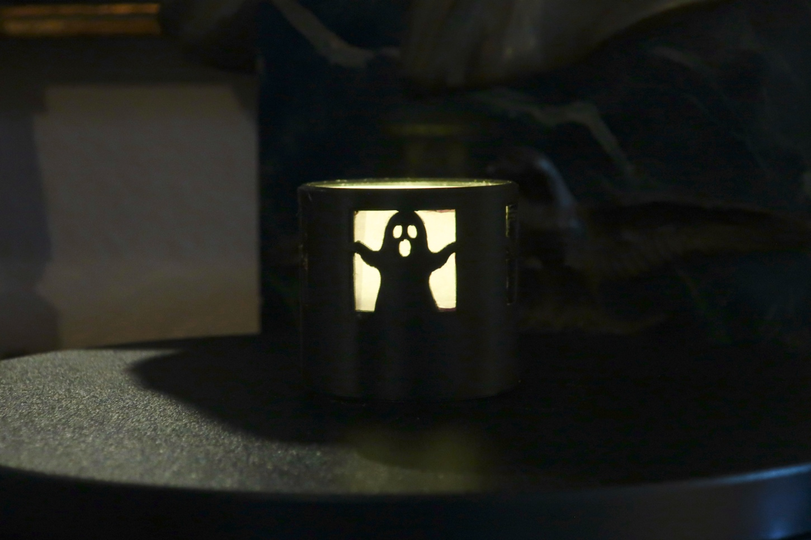
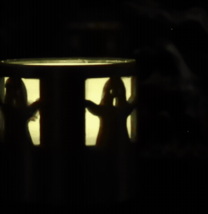

# The Ghost Lantern

Four ghosts standing at four lit windows, arms up, mouths open, entirely unbothered by the fact that you can see them. The other lanterns in this set cut their motif *out* of the wall. This one does the opposite: the ghost is the plastic and the window around it is the hole, so the figure stands dark against a glowing field with its eyes and mouth burning through.

Third of the Halloween lantern set. 43 × 43 × 40 mm, and a tea light goes inside.

Black PLA with a rolled printer-paper liner inside, over one tea light. The still settles the polarity argument below — the ghost is the plastic and the window is the hole, so the figure reads dark against an evenly lit field rather than as a bright ghost-shaped blob. The turn settles the *other* argument, the one about four windows rather than five: the ribs are wide enough that two ghosts are never competing for your attention, and the object stays a dark thing **with** windows in it rather than becoming a ring of light.

The animation is **90° of rotation, one quarter of a turn**, looping seamlessly. Four identical ghosts evenly spaced means a quarter *is* a full period of the object, so a whole revolution would be four copies of the same information. See [`raven_lantern`](../raven_lantern/) for how the loop point is found.

## Printing it as-is

`accepted/ghost_lantern.stl` is the mesh that was printed, already upright in the print pose. It went cleanly first time — the only part of the set that needed no rework at all.

| | |
|---|---|
| material | black PLA |
| layer height | 0.2 mm |
| orientation | upright on its base, as exported |
| supports | not needed — zero islands |
| nozzle temperature | **210 °C, not 220** |
| other | `Avoid crossing wall` at 100% detour, scarf seam around the whole wall |

Black is not a style choice here. The ghost has to read as a *dark* figure against a *lit* window, so the wall must be opaque. A pale filament transmits and the polarity collapses.

## Finishing it

1. **Roll a strip of printer paper into a tube and drop it inside the bore.** The flame is close to a line source; the paper re-emits it across its whole surface and turns it into a lit column.
2. Drop in a **flame-style battery tea light**.

The bore is loose deliberately and the liner takes up the slack — do not tighten it to stop a rattle. Check the bore for strings before the liner goes in, because the paper backlights whatever is in there.

## Making it your own

The body is shared across the set, so a new lantern is a motif and its constraints. [`examples/README.md`](../) walks through adding one.

The idea worth stealing from this part is a decision most people never realise they are allowed to make:

> **Choose the polarity. If a motif's recognition lives in its interior, make the motif the material rather than the hole.**

A ghost is a blob without its face. Under the set's usual polarity — motif as opening — its eyes and mouth would have to be chips of plastic floating inside a hole, held by thin webs. That is precisely what destroyed [`raven_lantern`](../raven_lantern/)'s lettering. Invert it and the problem evaporates: with the ghost as material, its eyes and mouth are simply **holes in material**, which costs nothing and cannot fall out.

Compare with [`witch_lantern`](../witch_lantern/), which is a hole and works fine — because a hat, a nose and a chin are all *outer contour*, and a silhouette carries them. The test is not "how detailed is the subject", it is **"does it read from its outline alone?"** If yes, cut it out. If no, invert it.

One companion rule, learned by fixing it here:

> **Anchor retained material at the BOTTOM.**

Support propagates upward, so a figure touching only the sides or the top of its window begins in mid-air. Extending the ghost's robe down to the bottom edge of the window, so it merges into the wall below, took this part from **29 floating islands to zero**. The artwork was edited by hand to do it — which is the right move, because part size is set by the object it holds and any conflict is resolved by changing the artwork, never the part.

## Final notes

**Four ghosts, not five.** The rest of the set uses five motifs, but this window is nearly square — 18.7 mm wide against 19 mm tall — where the others are tall and narrow. At five the ribs between windows get visually thin and the lantern starts reading as a row of windows rather than as a dark object *with* windows in it. Four restores the solid between them, and cuts a fifth of the long nozzle jumps per layer as a bonus.

**The rib threshold is a rule of thumb, honestly bracketed.** Solid material between adjacent motifs is set as a *fraction of motif width* rather than in millimetres, because a fixed millimetre floor means different things on a 17 mm motif and a 40 mm one. Four windows gave 0.767 and looked right; five gave 0.406 and looked thin. So the answer is somewhere between, and 2/3 is the memorable number nearest the midpoint, erring toward the side that was actually approved.
