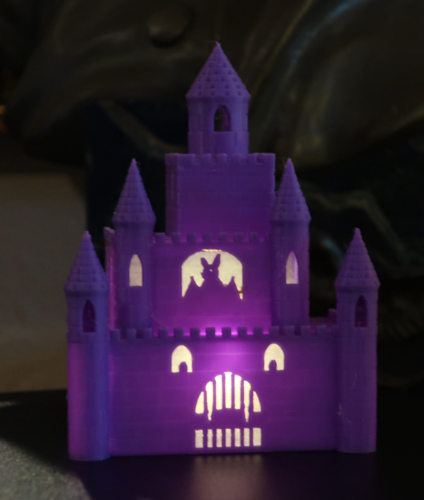
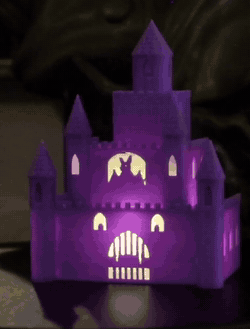

# The Mini Castle

The haunted castle, shrunk. Same four tiers, same toothed gate, same bat in the same window, same two upstairs eyes watching you — at half the size and a fifth of the print time. Whatever lives inside it has had to become considerably more compact, and is presumably annoyed about it.

68 × 46 × 89 mm, 23 g, about two hours. The full-size original is [`castle`](../castle/), at eleven.

Purple PLA, one flame-style tea light. **Watch the back of the turn**: the puck is lying on its side aimed at the face. That is not how the part was designed and it is how it works best — see the final note. Purple also transmits at this wall thickness, so the whole facade glows rather than staying dark between the openings; black would give you the silhouette the model actually describes. The corner-turret windows read dark either way, the same as on the full-size [`castle`](../castle/).

## Printing it as-is

`accepted/mini_castle.stl` is the mesh that was printed, already upright in the print pose.

| | |
|---|---|
| material | PLA — purple, in the printed one |
| layer height | 0.2 mm |
| orientation | upright, as exported |
| supports | tree, as for the full-size castle |
| nozzle temperature | **210 °C** |
| time | ~2 hours |

**Print this instead of the castle if your printer is short on Z.** The full-size part is 178 mm on a 180 mm machine, which is uncomfortably close. This one is 89 mm and has no such problem.

Do **not** simply scale the full castle to 50% in your slicer and expect this. It is not the same object — the two internal floors are removed so the three chambers become one tall cavity that a single tea light stands in. A scaled castle would give you three chambers too short to hold anything.

The one thing to fix that the printed one did not: it strung, finely, across the front and between the turrets. `SLICING.md` already carried the answer — **210 °C rather than 220** — and it simply was not applied here. Cosmetic at worst on a Halloween ornament, where it reads as cobweb, but free to avoid.

## Finishing it

1. Stand **one flame-style battery tea light** inside, through the open back.
2. Optionally glue **printer paper** behind the face's openings with a glue stick.

**Try the tea light on its side, aimed at the face.** That is how the printed one ended up being used, because it lit better — laid down, the flame becomes a point source at mid-height pointing horizontally, rather than a column standing on an opaque base. On this part it made the gate the brightest thing on the object. See [`owl`](../owl/) for what that changes and why it is worth knowing about.

## Making it your own

The interesting thing here is not the castle, it is **how this file is built**:

> **`model.py` contains no geometry.** It loads `castle/model.py` by path and subtracts two boxes. That is the entire part.

This is a **variant rather than a fork**. There is no copy of the castle's 1858 lines to keep in sync, it cannot drift from its parent, and a fix to the castle lands here for free. The cost is that it can only ever be *the castle plus a difference* — wanting proportions of its own would make it a separate part. If you want a size variant of something, try this shape before you copy a file.

Two lessons that transfer well past castles:

- **Derive the quantity that matters, not the inputs.** "Is it big enough at half size?" has no answer. "Is any single dimension short?" does — and the answer was not the obvious one. The ground floor accepts a 35 mm puck comfortably; its clear *height* was 22.6 mm against a puck 30 mm tall. Footprint was never the problem, and that is why the floors came out rather than the walls going wider.
- **A scaled part does not scale its contents.** Everything halves except the tea light, which is the same object it always was. That asymmetry drives the whole design and is completely invisible while you are working.

## Final notes

**The finished object is not the one that was designed**, and that is recorded on purpose. It was built around an upright puck whose opaque base was expected to swallow the gate. At the bench the puck was laid on its side, aimed at the face, because it simply lit better — and the gate became the *brightest* thing on the object instead of the darkest. `prints.md` has a prediction that was wrong in both directions and explains why, which is more useful than the part.

**Puck orientation is a design variable and nothing in this repo models it.** Two independent parts have now been improvised into the sideways configuration at the bench. That is the outer loop doing its job: the physical object teaching something no render, check or assertion could have raised, because nothing in the model knows the puck can be turned over.
