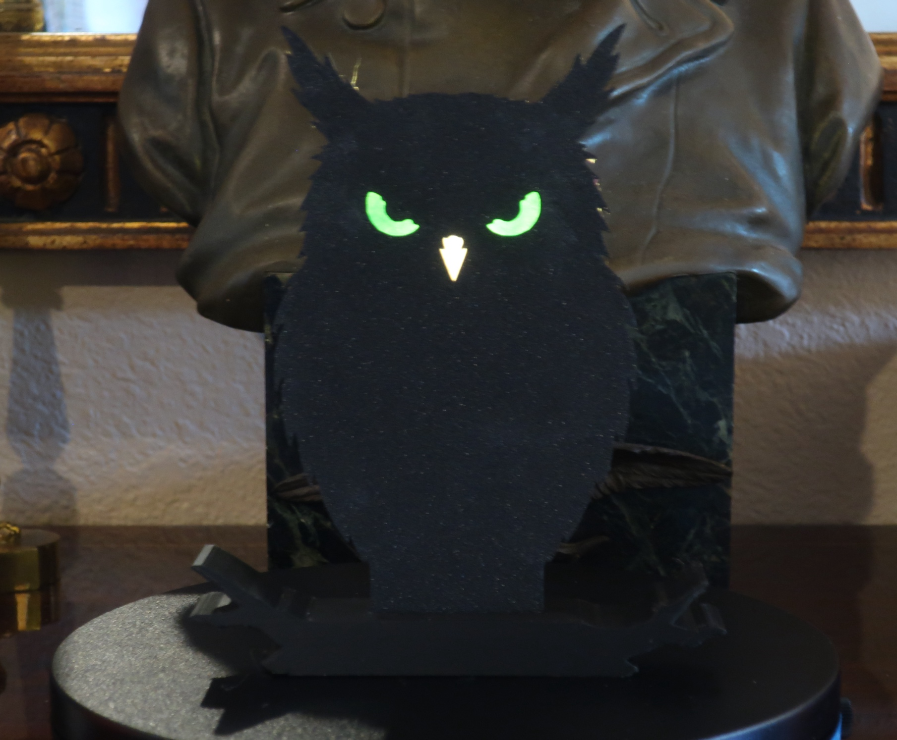
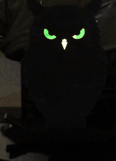
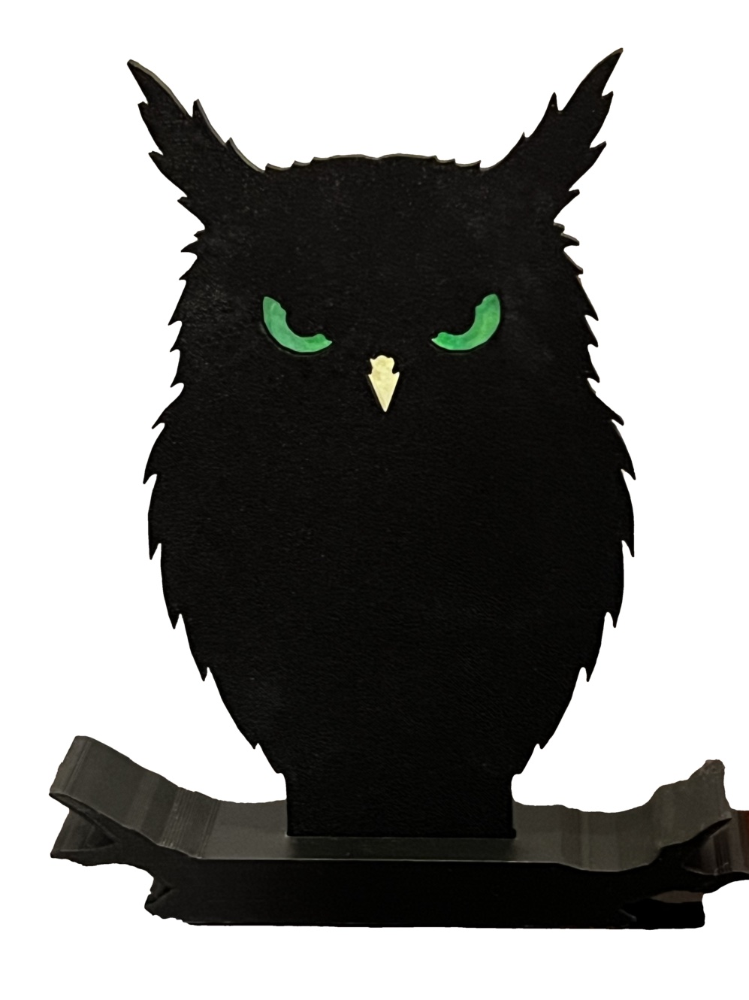

# The Angry Owl

He has been sitting on that branch for some time and he has formed opinions. Two narrowed green eyes, a pale beak, a fringe of feathers around a silhouette that is doing all the work — and behind him, a tea light making the whole thing glow just enough to be unsettling at the far end of a room.

140 mm tall, two pieces, printed in a single colour. Everything coloured in him is paper.

Lit, turning, and in daylight. The two photographs answer different questions: the daylight one shows the coloured paper, the lit one shows that the silhouette still carries the shape after dark — the ear tufts, the feathered edge and the branch all read against a lighter wall, and the three apertures supply the face rather than the whole owl. The turn is there for the back, where the puck lies **on its side** on the shelf, aimed forward at the eyes.

## Printing it as-is

The meshes in `accepted/` are the ones that were printed:

| | |
|---|---|
| `owl-plate.stl` | the owl. Prints **lying flat**, apertures and all — no supports |
| `owl-branch.stl` | the perch. Prints on its base |

| | |
|---|---|
| material | black PLA |
| layer height | 0.2 mm |
| orientation | as exported — do not rotate either piece |
| supports | none |

Black is the sensible choice: the whole design is a silhouette, so the plate wants to be opaque and the light should appear only through the three apertures. A pale filament would transmit and wash the effect out.

## Finishing it

Four steps and no tools.

1. **Drop the plate's tab into the branch's slot.** It is a clearance fit and needs **no glue** — its own weight holds it, and it lifts out again, so the thing stores flat.
2. **Glue paper over the eyes and beak on the *back* of the plate.** A glue stick is the right adhesive: it does not cockle the paper, does not bleed through and dull the colour, and releases if you want to redo it.
3. **Colour the paper over the eyes** with an art marker — green here, whatever you like.
4. **Stand a flame-style battery tea light on the shelf** behind the owl's head.

## Making it your own

The technique this part exists to demonstrate:

> **The paper behind an aperture is a finishing surface, not just a diffuser. The geometry sets the shape, the paper sets the brightness, the marker sets the hue.**

Three independent controls on one hole — which means a single-colour print gets a multi-colour face with no multi-material printer, no AMS and no second piece. His eyes are green because of a marker, not because of the filament.

Two cautions, both learned here. **Tinting attenuates**, so colour is also a brightness control and it competes with whatever the geometry intended: the eyes are tinted here and the beak is not, which works against the design's intent that the eyes dominate. And **marker on paper goes on unevenly** — invisible unlit, amplified backlit, because a thin patch transmits more. Coloured tissue is the flat-field alternative.

If you are building something similar, one habit is worth more than any of the geometry:

> **On a part whose show side is flat, depth has to be asserted rather than reviewed.**

Everything that went wrong while modelling this went wrong in the depth direction — a shelf facing backwards, a piece placed relative to the wrong plane, a rotation silently discarded — and the front elevation looked perfectly fine in every single case. `model.py`'s `check()` is mostly probes for material where material should be and air where the tab has to go. `CLAUDE.md` at the repo root lists the specific library behaviours that cause this.

## Final notes

**The tea light has an orientation, and it is not in the model.** A flame-style tea light is an opaque base with a narrow flame on top, and the LED sits in the lower part of that flame — so the shelf height here is derived to put that short lit column across the eyes. Lay the puck on its **side** instead and it becomes a different source: a point on the cylinder axis, aimed sideways, with the opaque base beside the flame rather than under it. That lights the eyes about as well and stops shadowing the beak. If a part of this kind lights differently from how you expected, check this first.

**Two numbers here are right for reasons that are not.** The shelf height assumes an upright puck, and the one in the photograph is lying on its side. The slot clearance was sized as a *glue gap* for glue that turned out to be unnecessary. Both values still work, nothing fails, and nothing warns you — which is exactly why they are written down. A derived value is only as trustworthy as its premise.
