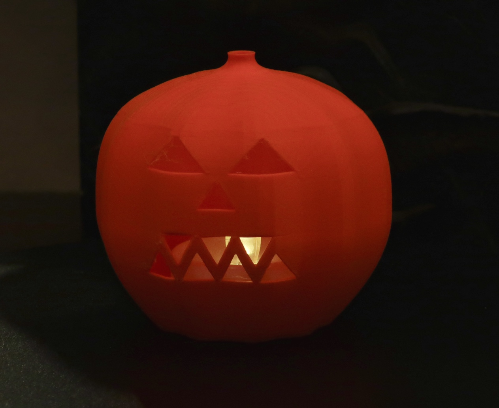
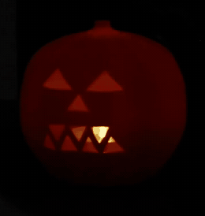

# The Pumpkin Lantern

A jack-o'-lantern with a proper grin, which you place over a tea light like a small orange hat. No lid, no base, no assembly, no dignity. It glows from the inside like a pumpkin should — not just through the face, but through the whole ribbed body, because orange PLA at this thickness is less a wall than a lampshade.

73 × 70 × 66 mm, one piece, open at the bottom.

Orange PLA over one flame-style tea light. The turn shows what a still cannot: the face is on **one side only**, and the back is nothing but glowing ribs — because the body lights whichever way it is pointing. It also appears beside the [`castle`](../castle/), for scale.

## Printing it as-is

`accepted/pumpkin_lantern.stl` is the mesh that was printed, upright on its own skirt.

| | |
|---|---|
| material | **orange PLA** |
| layer height | 0.2 mm |
| orientation | upright, as exported |
| supports | none |
| nozzle temperature | 210 °C |

**Print this one in a light, translucent filament and mean it.** Every other lantern here is a silhouette, where the wall is opaque and light appears only through the openings. This part is the exception: the wall is a *filter*, not a boundary, and wall thickness is an **optical parameter** rather than a structural one. In black it would be a pumpkin-shaped hole in the dark. In orange it glows all over, which is the entire point.

The teeth bridge cleanly at 7.6 mm and need no support.

## Finishing it

There is nothing to finish. Stand a **flame-style battery tea light** on the table and drop the pumpkin over it.

No paper liner, unlike the cylinder lanterns — the body is its own diffuser. To change the batteries, lift the pumpkin off.

## Making it your own

Two ideas here, and the first one is the reason this part exists in the examples at all:

> **Wall thickness can be an optical parameter.**

Ask what a wall is *for* before you size it. On the cylinder lanterns it is a boundary and its thickness is about strength and minimum feature size. Here it is a filter, and its thickness sets how much light comes through — a completely different job for the same number, and one no generic "minimum wall" check knows anything about. If your part is meant to glow rather than to silhouette, the wall is part of the light path and belongs in the lighting reasoning, not the structural reasoning.

> **A part earns its pieces.**

This was originally a **two-piece design** — a base that held the puck, a lid that carried the face, and a lip joining them. The first print showed the base was not earning its place: it added an assembly step, a seam across the show side, and a tolerance to get wrong, in exchange for holding a puck that sits perfectly well on a table by itself. Deleting it made the object better in every dimension at once. The old criteria are in the history; the spec was rewritten around what the print actually taught.

A related note on how the defect was caught: it was spotted in the **sliced preview**, not in anything the harness reported, and the print was killed part-way through on purpose. The slicer's preview is a review surface the harness does not have, and it is worth a look before you commit hours.

## Final notes

**The face is offset, deliberately.** An earlier tooth arrangement paired triangle apexes across the mouth and produced a distracting diamond illusion — the eye latched onto a horizontal band that was not meant to be there. Offsetting and overlapping the triangles breaks the pairing and the illusion goes away. Worth knowing if you redraw the face: repeated geometric features can create structure nobody drew.

**It reads as a pumpkin unlit as well as lit**, which the ribbing and the stem do most of the work for. That was a criterion, not a happy accident — an ornament sits on a shelf in daylight far more of the time than it spends glowing in the dark.
