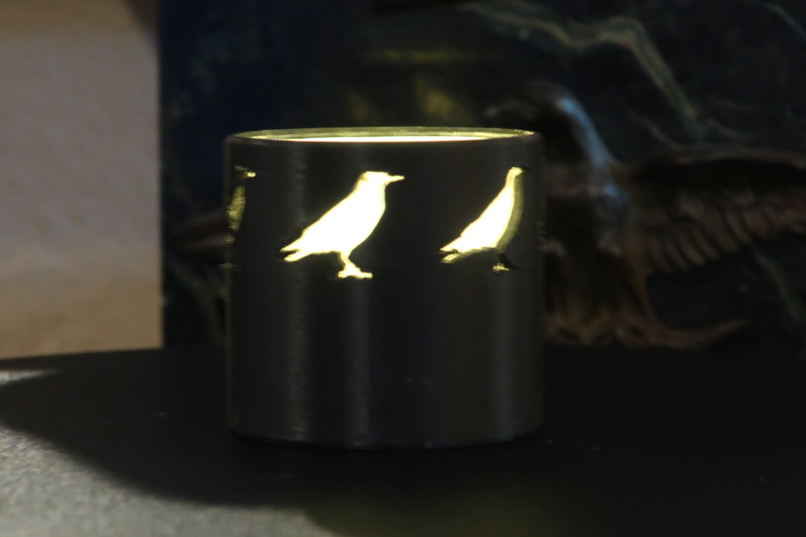
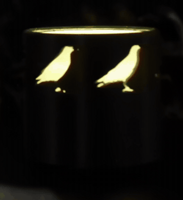

# The Raven Lantern

Six ravens circling a black cylinder, waiting for something to happen to you. There was a *Nevermore* beneath them once. It did not survive the printing — which is either a sobering lesson about fragile geometry or the most thematically appropriate failure in this repository, depending on your mood.

First of the Halloween lantern set. 43 × 43 × 40 mm, and a tea light goes inside.

Black PLA with a rolled printer-paper liner inside, over one tea light. The band below the birds is where *Nevermore* was, and its emptiness is the whole story of this part.

That animation is **3.1 seconds long and shows 60° of rotation**, which is one sixth of a turn — and it loops forever without a visible seam. Six identical ravens evenly spaced means 60° is a full period of the object: rotate it that far and it is indistinguishable from where it started. So the footage of a full turn is six copies of the same information, and one copy is all the file needs to carry. 616 kB against the 2.3 MB the other lanterns spend on a whole revolution.

Worth stealing if you photograph anything with rotational symmetry: **film a full turn, then keep only one period of it.**

This photograph carries more weight than the others in the set, for a reason worth knowing: **the source artwork for these ravens is gone.** It lived in a per-session image cache rather than in the part, so the outline now exists only as a list of coordinates and can never be re-traced against what it was meant to look like. A picture of the printed object is therefore the only remaining record of how the motif actually *reads*. That is why every traced part in this repo now keeps its reference image in `inspiration/`, committed alongside the model.

## Printing it as-is

`accepted/raven_lantern.stl` is the mesh that was printed. It is already upright in the print pose.

| | |
|---|---|
| material | black PLA |
| layer height | 0.2 mm |
| orientation | upright on its base, as exported |
| supports | not needed |
| nozzle temperature | **210 °C, not 220** |

Two settings are worth copying and neither is obvious:

- **210 °C.** Every opening is a gap the nozzle jumps on each layer of the motif band, so a lantern strings more than its size suggests. Ten degrees fixed it here after retraction, seam and wall settings had all already been tuned. It is the first thing to try, not the fourth — a filament dryer was very nearly bought instead.
- **`Avoid crossing wall` at 100% detour.** Applies to any wall with openings pierced through it.

**Black is doing real work.** These are silhouette lanterns: the wall is meant to be opaque so that light appears only where the wall is absent. Print one in a pale filament and the wall transmits, the motif stops reading as a hole, and you get a glowing tube instead. See [`castle`](../castle/) for what that looks like when it happens by accident, and [`pumpkin_lantern`](../pumpkin_lantern/) for a part that wants it on purpose.

## Finishing it

1. **Roll a strip of ordinary printer paper into a tube and drop it inside the bore.** This is not optional decoration — the flame in a tea light is nearly a line source, and the paper intercepts it and re-emits over its whole surface, turning it into a lit column. It is what makes a motif band taller than the LED work at all.
2. Drop in a **flame-style battery tea light**.

The bore is deliberately loose and the liner takes up the slack. **Do not tighten the fit to cure a rattle** — that was tried, at 0.6 mm clearance, and the puck would not go in at all. It is 1.6 mm now. A rattle is much cheaper than a lantern you cannot load.

Check the inside of the bore before fitting the liner. The paper rolls up *against* any stray strings or support residue in there and backlights them, so interior mess is silhouetted rather than hidden — the opposite of the usual assumption.

## Making it your own

The lantern body is shared across the whole set, so a new lantern is **a motif and its constraints and not much else**. [`examples/README.md`](../) walks through adding one; take `inner_r()`, `outer_r()`, `motif_top()` and `lit_window()` from `projects/halloween_lantern/shared.py` and do not pick your own height, bore or wall, or it stops being a member of the set.

The lesson this part paid for is worth having before you design anything small:

> **A feature can be perfectly printable and still not survive being made.**

The *Nevermore* died because the counters of `R` and `O` need retaining webs, the webs were 0.5 mm — a single extrusion — and the slicer put support material inside the letter openings, so removing it pulled directly on them. The webs were sized against the nozzle, which asks "can the machine lay this down", and never against post-processing, which is where they actually failed. **The feature and the thing that killed it were the same feature.**

The practical rule that follows: do not put a fragile feature where a support has to be removed from. And prefer motifs that read from their **outer contour** — see [`witch_lantern`](../witch_lantern/) for why a silhouette survives being made small when interior detail does not.

## Final notes

**The source artwork for this part is gone.** It lived in a per-session chat image cache rather than in the repo, and by the time anyone noticed, it had been cleaned up. The outline in `raven_openings.py` can therefore only be edited as coordinates, never re-traced against what it was supposed to look like. Every other traced part here now keeps its source in `inspiration/` because of this one. If you take one habit from this part, take that one.

**Opening count is a printability parameter, not just a compositional one.** Every opening is another long nozzle jump per layer. Four to six is the working range for this body; more and it strings, and it also starts reading as a colander rather than as a dark object with holes in it.
