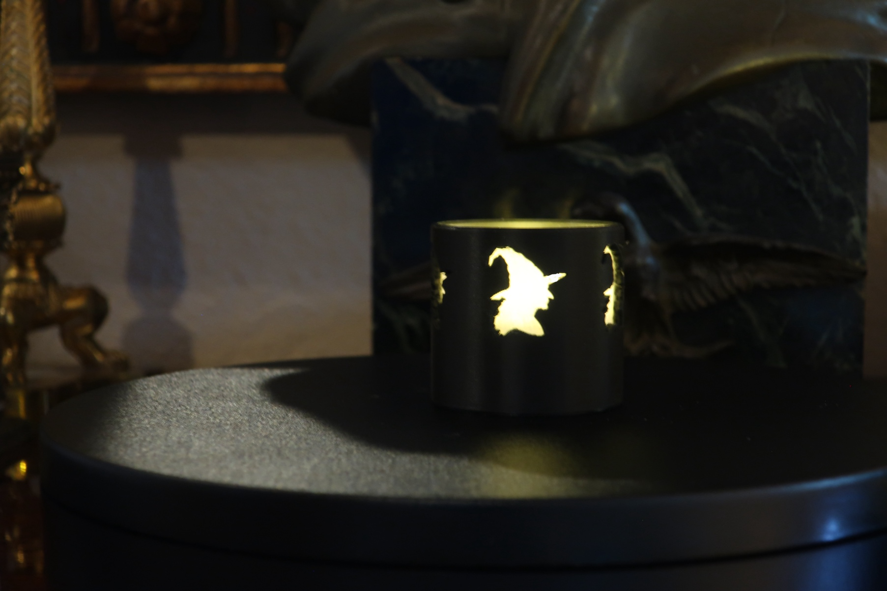
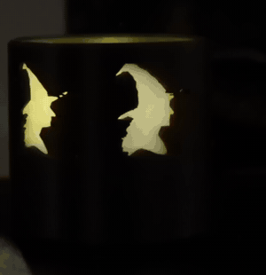

# The Witch Lantern

Five witches in profile, going round and round, hat brims and hooked noses and hair streaming out behind them as though the whole cylinder were travelling at speed. It is not. It is sitting on a shelf being smug about it.

Second of the Halloween lantern set. 43 × 43 × 40 mm, and a tea light goes inside.

Black PLA with a rolled printer-paper liner inside, over one tea light. The turn is what the part is *for* — a single witch is a picture, a procession of them going past is the thing the design was reaching for, and the object only does it when it moves or you do.

The animation is **72° of rotation, one fifth of a turn**, looping seamlessly. Five identical witches evenly spaced means a fifth *is* a full period of the object, so that is all the footage the file needs to carry. See [`raven_lantern`](../raven_lantern/) for the technique.

It also shows why five works here when [`ghost_lantern`](../ghost_lantern/) had to come down to four. The rule of thumb is a fraction of **motif width**, not a millimetre floor: a witch in profile is narrow, so five of them still leave real unlit wall between neighbours. A ghost with its arms out is nearly as wide as it is tall, and five of those turn the lantern into a ring of light.

## Printing it as-is

`accepted/witch_lantern.stl` is the mesh that was printed, already upright in the print pose.

| | |
|---|---|
| material | black PLA |
| layer height | 0.2 mm |
| orientation | upright on its base, as exported |
| supports | **yes — enable them** |
| nozzle temperature | **210 °C, not 220** |

**This one wants supports and that is fine.** The notch between the hat's curled tip and its crown puts a wedge of wall hanging down into the opening with nothing beneath it — fifteen small islands. They print with support and the support comes off cleanly, because a hat brim is millimetres thick. Do not try to reshape the hat to avoid them.

Black matters: these are silhouette lanterns, and a pale filament transmits through the wall and stops the motif reading as a hole.

## Finishing it

1. **Roll a strip of printer paper into a tube and drop it in the bore.** The flame is nearly a line source; the paper re-emits it over its whole surface and turns it into a lit column. This is what makes the motif band work.
2. Drop in a **flame-style battery tea light**.

Inspect the bore before the liner goes in — the paper rolls up against any strings or support residue and backlights them, so mess in there is silhouetted rather than hidden.

The bore is loose on purpose and the liner takes up the slack. Do not tighten it to stop a rattle.

## Making it your own

The body is shared across the set, so a new lantern is a motif and its constraints. [`examples/README.md`](../) walks through it.

This is the part to read before you choose a subject, because it was designed twice:

> **A motif that reads from its outer contour survives being made small. A motif whose recognition lives in its interior does not.**

It began as a **witch flying across a full moon** — she was the solid material, the moon the opening. It was abandoned after two rounds of regenerated artwork. A flying witch reads because her arm is separate from her body and her hand grips the broom, and at the size this lantern allows those gaps measured **0.79 mm and 0.40 mm** — one marginal, one exactly one nozzle width. Close them and she is a dark mass in a hat; keep them and the machine cannot make them.

No amount of merging, dilating or re-tracing fixes that, because those operations work on the boundary and the problem is not the boundary. The final trace matched the reference at 0.93 IoU — the geometry was *right* — and it still did not read.

A head in profile has no such problem. Hat, brim, nose and chin are all outline: **98.4% of its area survives a 0.4 mm nozzle at 19 mm tall with no simplification at all.** Judge this by simulating the nozzle — a morphological opening at the nozzle radius — and looking at the result, not by reasoning about feature sizes. `ARTWORK.md` at the repo root has the method.

The other thing this part settled, against the set's own prior rule:

> **Supports are judged by what they touch, not banned outright.**

The set used to say "if a motif needs supports, reconsider the motif", generalised from [`raven_lantern`](../raven_lantern/) losing its lettering. That was too strong. The lettering died because 0.5 mm single-extrusion webs cannot survive anything being pried off them — supports were the occasion, not the cause. Over-generalising from one failure is itself a failure.

## Final notes

**The render sheet cannot review this part.** `cad build` writes a shaded grey solid, so the motif and the wall come out the same tone and a figure/ground design dissolves into abstract shapes — it looked like the wrong artwork had been traced. For any motif whose whole point is contrast, review from a **true-scale two-tone flat** instead, and never from a magnified one. The abandoned flying-witch design was approved at 5× magnification and failed at 1×.

**It was judged the only way a silhouette can be judged**: someone who had not been told what it was looked at it and said "witch". Recognition by a person with no context is the entire point, and the people who designed it are the last ones able to assess it.
